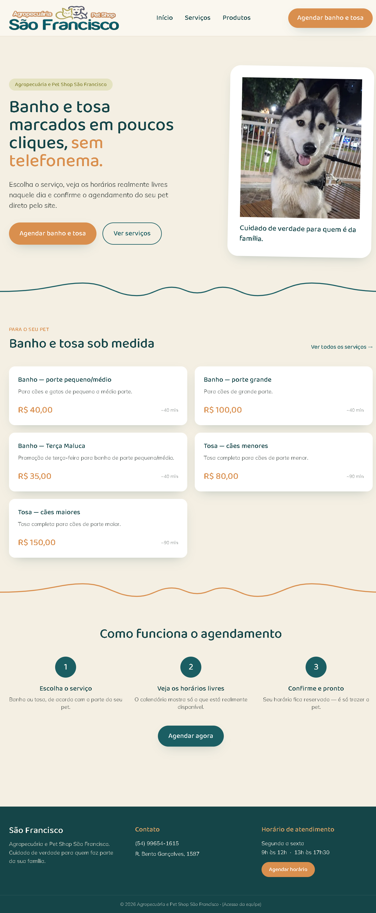
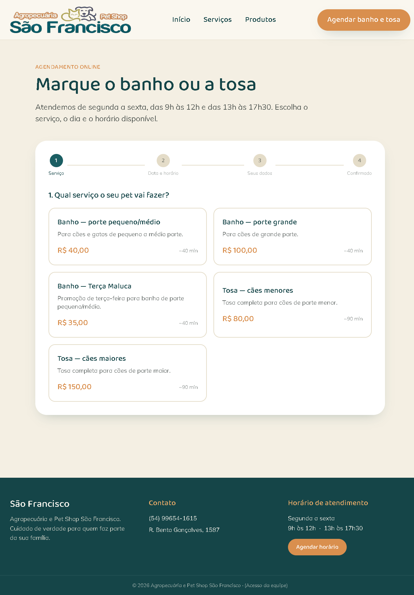
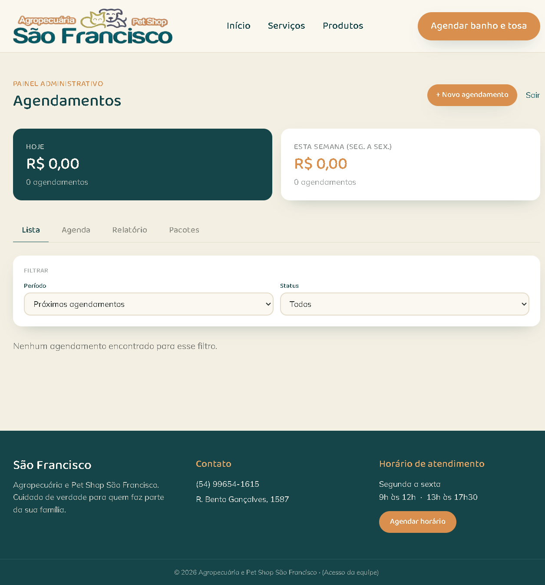
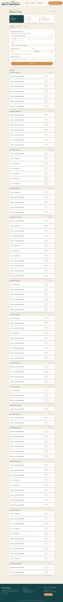

# # 🐾 Pet Shop São Francisco

Sistema web desenvolvido para modernizar o atendimento da Agropecuária e Pet Shop São Francisco, centralizando o agendamento de banhos e tosas, o controle financeiro e a organização da rotina da equipe — reduzindo a dependência de agendamentos via WhatsApp/telefone.

Mais do que um site institucional, o projeto é pensado como **ferramenta de gestão** para o dia a dia do pet shop, com prioridade máxima para uso em celular (mobile first).

## ✨ Principais Funcionalidades

### Área do cliente
- Apresentação da loja, dos serviços (banho e tosa) e das categorias de produtos.
- Agendamento online em poucos passos: escolha do serviço → data e horário realmente disponíveis → dados do cliente → confirmação.
- Calendário que já desconta horários ocupados e respeita o horário de funcionamento (segunda a sexta, 9h–12h e 13h–17h30).

### Painel administrativo (`/admin`)
- Visão geral do faturamento do dia e da semana.
- Lista de agendamentos com filtros por período (hoje, semana, mês, personalizado) e por status.
- Agenda semanal visual (grade por horário no desktop, lista por dia no mobile), com criação de agendamento clicando direto no horário livre.
- Cadastro manual de agendamentos (cliente que chega sem marcar pelo site).
- Edição e cancelamento/exclusão de agendamentos.
- Relatório mensal de faturamento, por serviço e por semana.
- Controle de **pacotes de sessões** (ex: 4 banhos por um valor fechado), com marcação de pagamento e desconto automático das sessões usadas.

### Painel de produção (`/producao`)
- Área de uso pessoal de quem realiza os banhos e tosas, para registrar atendimentos e acompanhar a comissão (50% do valor do serviço).
- Resumo de comissão do dia, da semana e do mês.
- Relatório diário/semanal/mensal, com exportação em PDF e compartilhamento de resumo.
- Suporte a pacotes de sessões também nesse fluxo.

## 🧱 Stack Técnica

- **Next.js 14** (App Router) + React 18
- **Tailwind CSS** para estilização
- **Neon (Postgres)** via `@neondatabase/serverless` para persistência
- **jsPDF / jspdf-autotable** para geração de relatórios em PDF
- Autenticação simples por senha (cookies httpOnly) para as áreas `/admin` e `/producao`, protegidas via `middleware.js`

## 🚀 Rodando o projeto localmente

```bash
cd petshop
npm install
npm run dev
```

Acesse em [http://localhost:3000](http://localhost:3000).

### Variáveis de ambiente

Copie `petshop/.env.example` para `petshop/.env.local` e preencha:

| Variável | Descrição |
|---|---|
| `ADMIN_PASSWORD` | Senha de acesso ao painel administrativo (`/admin`) |
| `FUNCIONARIO_PASSWORD` | Senha de acesso ao painel de produção (`/producao`) |
| `DATABASE_URL` | Preenchida automaticamente pela Vercel ao conectar um banco Neon (Postgres) pelo Marketplace — não precisa ser preenchida manualmente em produção |

O schema do banco (`petshop/schema.sql`) é criado automaticamente na primeira requisição, mas também pode ser executado manualmente antes de publicar o site.

## 📷 Demonstração

> Adicione capturas de tela nas pastas indicadas abaixo.

### Página inicial


### Agendamento


### Painel Administrativo


### Painel de Produção


## 📌 Roadmap / Visão de longo prazo

O projeto deve evoluir para se tornar o principal sistema de gestão do pet shop, incorporando novas funcionalidades (como controle de gastos por período) sempre priorizando simplicidade, usabilidade mobile e facilidade de manutenção.
